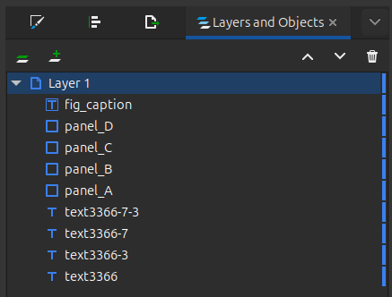
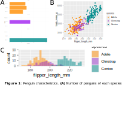

```{r, include = FALSE}
knitr::opts_chunk$set(
  collapse = TRUE,
  comment = "#>"
)
```

We are going to use the `palmerpenguins` dataset to create a multi-panel figure, containing:

* Plots created with `ggplot2`
* A jpeg image
* A figure caption, which will be completed from R using `svgedit`

## SVG template

First, we need to create an SVG template in Inkscape.

* Draw rectangles where the plots and image will go
* Add text boxes for the figure title and caption, with `{}` where `svgedit` should insert text
* Open the "Layers and Objects" panel (Ctrl+Shift+L) and name the layers according to the content they will hold, e.g. `panel_A`, `panel_B`, `fig_caption`, etc.

This is what our template looks like:

{ width=80% }

The four rectangles have labels `panel_A`, `panel_B`, `panel_C`, and `panel_D`, while the caption text box is labelled `fig_caption`.

{ width=50% }

## Load data and create plots

``` {r}
library(palmerpenguins)
library(ggplot2)
data("penguins")

# Number of penguins per species/island
penguins_count <- ggplot(penguins, aes(x = island, fill = species)) +
  geom_bar(alpha = 0.8) +
  scale_fill_manual(values = c("darkorange", "purple", "cyan4"), 
                    guide = "none") +
  theme_minimal() +
  facet_wrap(~species, ncol = 1) +
  coord_flip()

# Flipper length distribution by species
flipper_length <- ggplot(data = penguins, aes(x = flipper_length_mm)) +
  geom_histogram(aes(fill = species), alpha = 0.5, position = "identity") +
  scale_fill_manual(values = c("darkorange", "darkorchid", "cyan4"))

# Body mass vs flipper length colored by species
body_mass_vs_flipper_length <- ggplot(
  data = penguins,
  aes(x = flipper_length_mm, y = body_mass_g)
) +
  geom_point(aes(color = species,
                 shape = species),
             size = 2) +
  scale_color_manual(values = c("darkorange", "darkorchid", "cyan4"))
```

# Use svgedit to insert elements into the SVG template

```{r warning=FALSE}
library(svgedit)

svgedit::draw(
  input_svg = "../inst/examples/Template.svg",
  output_svg = "../inst/examples/penguins_figure.svg",
  plots = list(
    panel_A = penguins_count,
    panel_B = body_mass_vs_flipper_length,
    panel_C = flipper_length
  ),
  text = list(
    fig_caption = c(
      "1",
      "Number of penguins of each species per island",
      "Body mass vs flipper length colored by species",
      "Flipper length distribution by species",
      "Photo of an Adelie Penguin (Diego Tirira, CC BY-SA 2.0)"
    )
  ),
  images = list(
    panel_D = "../inst/examples/adelie_penguin.jpeg"
  )
)
```

This will produce the completed figure:

{ width=80% }
